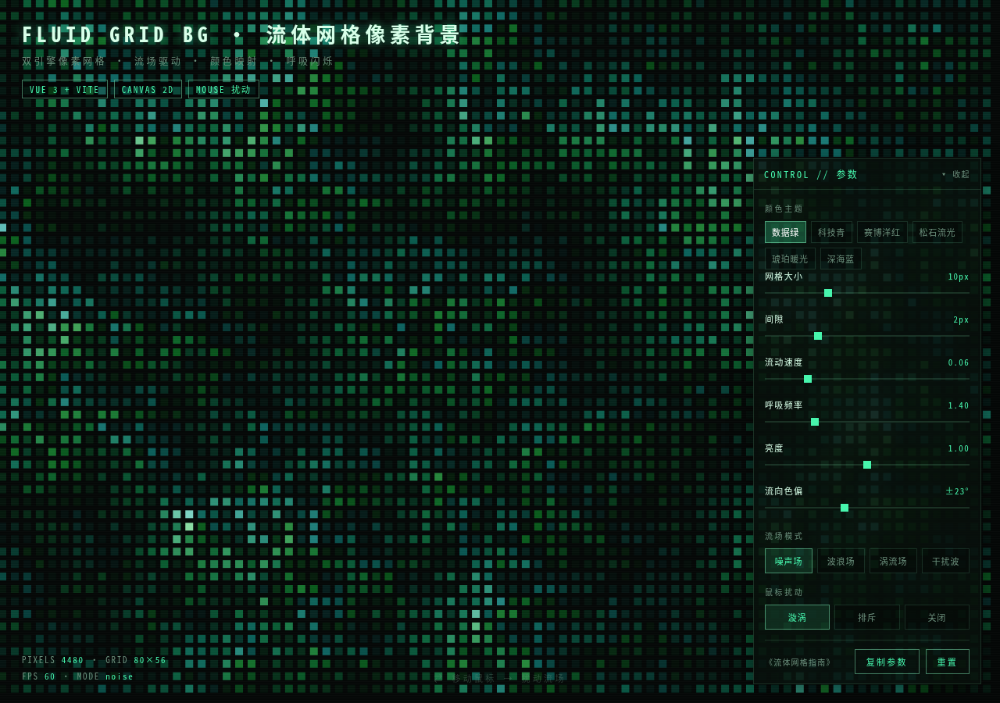
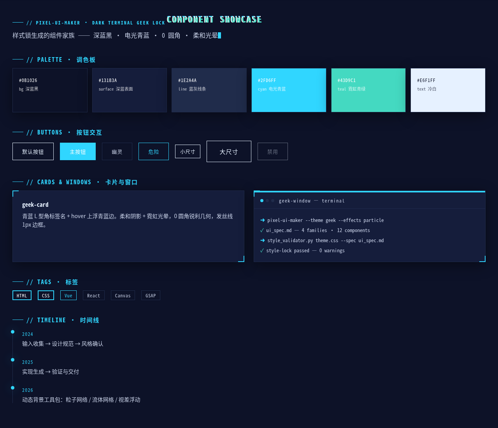
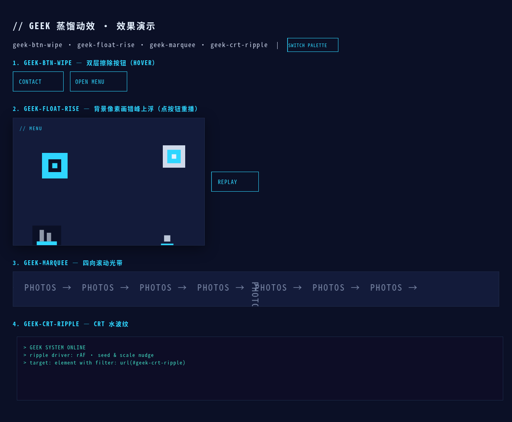
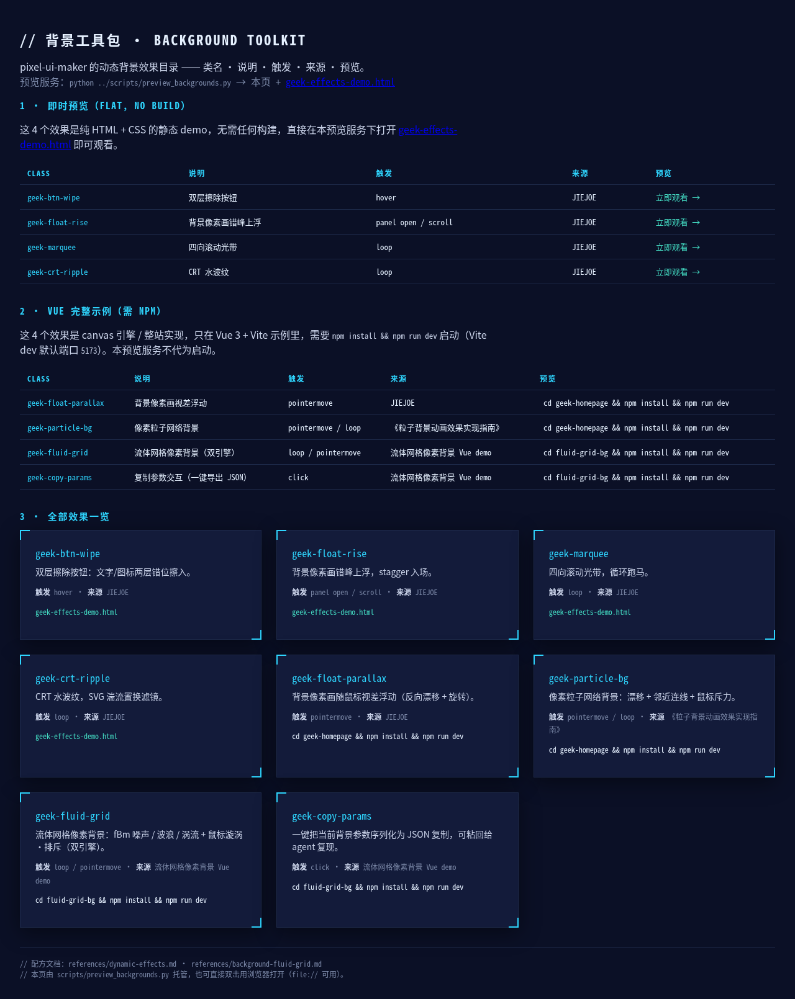
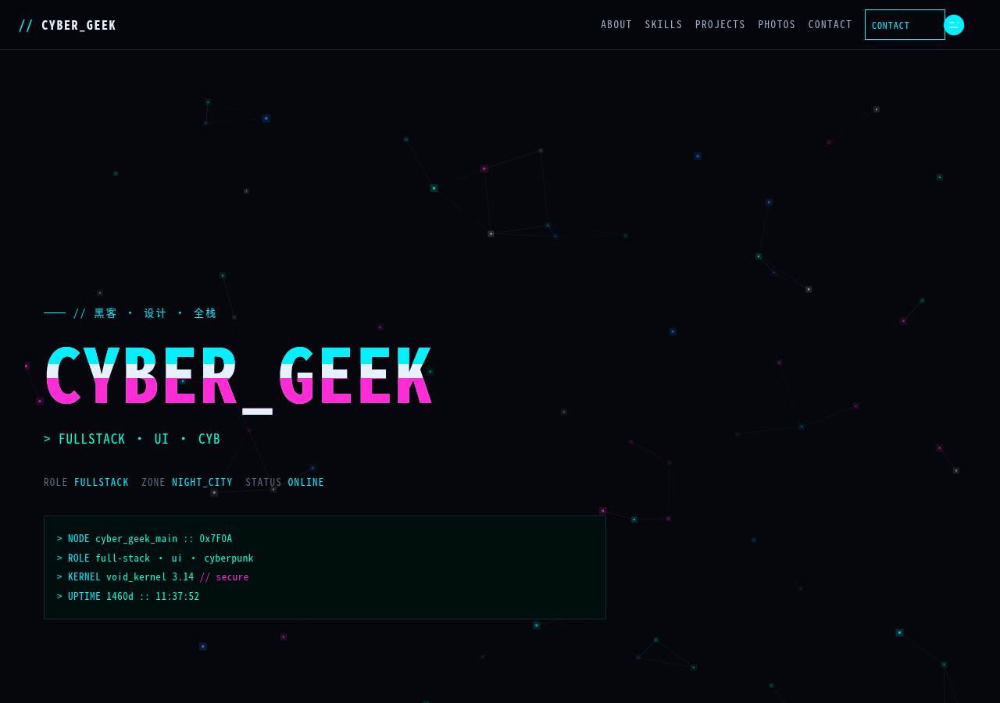

# Pixel UI Maker

> 像素数据流风 UI / CSS 主题制作器 —— 一个 [Claude Code](https://claude.com/claude-code) 技能，把界面描述、线框图或参考设计转换为完整的**像素数据流**风格 UI 实现（CSS + 组件标记），并保持严格统一的视觉风格。

本技能的设计语言：橄榄黑底 + 信号红强调色、0 圆角锐利几何、红色角标、CRT scanline / glitch / typewriter 终端 motif、柔和光晕与平滑动效。

> 🌐 English version: [README.en.md](README.en.md)

> ⭐ **旗舰示例 / Flagship demo** —— `examples/fluid-grid-bg/`：双引擎流体网格 canvas 背景 `geek-fluid-grid`（fBm 噪声 / 波浪 / 涡流 + 鼠标漩涡·排斥）+ `geek-copy-params` 一键导出参数。运行 `cd examples/fluid-grid-bg && npm install && npm run dev`。



---

## 它能做什么

输入一段界面描述、线框图或现有的 CSS / 参考截图，该技能会产出：

1. **UI 设计规范**（`ui_spec.md`）—— 主题名称、风格、调色板、样式锁参数、组件清单和动画方案。
2. **CSS 实现**（`theme.css` 或按家族拆分）—— 使用 `--geek-*` 自定义属性与 `geek-` 前缀组件类。
3. **动态效果**（蒸馏动效 + 粒子背景动画指南，见 `references/dynamic-effects.md`）—— 双层擦除按钮 `geek-btn-wipe`、背景像素画视差浮动 `geek-float-parallax`（鼠标跟随，纯 CSS / GSAP）、背景像素画错峰上浮 `geek-float-rise`（纯 CSS / GSAP）、背景像素粒子网络 `geek-particle-bg`（canvas 像素方块 + 邻近连线 + 鼠标排斥）、四向滚动光带 `geek-marquee`、CRT 水波纹 `geek-crt-ripple`。以及**流体网格像素背景** `geek-fluid-grid`（Canvas 双引擎：噪声/波浪/涡流流场 + 鼠标扰动，或双噪声场 + 呼吸潮汐；含 `geek-copy-params` 复制参数按钮；见 `references/background-fluid-grid.md`，完整源码在 `examples/fluid-grid-bg/`）。以上动效的完整 Vue 实现见 `examples/geek-homepage/`（CYBER GEEK 个人主页），全部可运行示例见 `examples/README.md`。
4. **验证** —— 自动检查每个组件是否遵守样式锁规则。

核心产出形态示例：

```css
:root {
  --geek-color-bg:        #1d211c;   /* 橄榄黑底 */
  --geek-color-bg-soft:   #232825;   /* 表面 */
  --geek-color-red:       #c9151e;   /* 主强调色 */
  --geek-shadow-glow:     0 0 24px rgba(201, 21, 30, .45);
  --geek-space-1: 4px;  --geek-space-2: 8px;
}

.geek-btn {           /* 按钮：mono 描边，hover 反白 + 红光晕 + 上浮 */
  font-family: var(--geek-font-mono);
  border: 1px solid var(--geek-color-text);
  border-radius: 0;
  transition: box-shadow .2s ease, transform .3s ease;
}
.geek-btn:hover {
  transform: translateY(-2px);
  box-shadow: var(--geek-shadow-glow);
}
.corner:before, .corner:after { ... }   /* 红色 L 型角标 */
```

---

## 组件展示 / Component Showcase

以下截图来自仓库内可运行示例（三个示例页通过 `data-theme="scifi"` 切换为**科幻蓝**配色：深蓝黑底 `#0b1026` + 电光青蓝强调 `#2fd6ff`；skill 默认的橄榄黑/信号红调色板保持不变）。想**现场观看**，一行命令起本地预览服务器（Python 标准库，零依赖）：

```bash
python scripts/preview_backgrounds.py     # 默认端口 8000，占用自动递增
# 打开 http://localhost:8000/  → 背景工具包画廊（全部 8 个动态背景效果目录）
# 打开 http://localhost:8000/components.html        → 核心组件展示
# 打开 http://localhost:8000/geek-effects-demo.html → 动态效果 demo
```

### 核心组件（按钮 / 卡片 / 窗口 / 标签 / 调色板）



- `geek-btn` —— 默认 / primary / ghost / danger / `--sm` / `--lg` / disabled，hover 反白 + 青蓝光晕 + 上浮
- `geek-card` —— 青蓝 `.corner` L 型角标 + hover 上浮青蓝边
- `geek-window` —— 4px 青蓝顶条标题栏终端窗口
- `geek-tag` —— 单选/警告/普通标签
- 签名 motif：`//` 眉题、glitch 标题、typewriter 光标、发光时间线圆点

### 动态效果（背景工具包）



`geek-btn-wipe` 双层擦除按钮、`geek-float-rise` 背景像素画错峰上浮、`geek-marquee` 四向滚动光带、`geek-crt-ripple` CRT 水波纹（静态 demo 即看）。



### Vue 完整示例（canvas 引擎，需 npm）

另外 4 个 canvas 引擎效果在 Vue demo 里，运行 `npm install && npm run dev`（Vite 默认端口 5173）。Vue demo 保持各自原生配色（dark cyberpunk / 流体网格），与上面静态示例的科幻蓝变体不同。**流体网格见文首 ⭐ 旗舰示例**。



`examples/geek-homepage/` —— CYBER GEEK 个人主页：`geek-particle-bg` 像素粒子网络、`geek-float-parallax` 视差浮动、glitch / 打字机 / CRT、四向滚动光带、双层擦除按钮等 11 组件 + 3 composables。运行 `cd examples/geek-homepage && npm install && npm run dev`。

> 完整可运行示例索引见 [`examples/README.md`](examples/README.md)；效果配方见 [`references/dynamic-effects.md`](references/dynamic-effects.md) 与 [`references/background-fluid-grid.md`](references/background-fluid-grid.md)。

### 组件源码速查 / Source Snapshot

截图看不够?这里直接给**真实源码**——`examples/` 里的可运行页面,复制即可带走。完整文件:

- [`examples/components.html`](examples/components.html) — 核心组件展示页(调色板 / 按钮 / 卡片 / 窗口 / 标签 / 签名 motif)
- [`examples/geek-effects-demo.html`](examples/geek-effects-demo.html) + [`examples/geek-effects-demo.css`](examples/geek-effects-demo.css) — 动态效果 demo + 样式锁 token 全集

**HTML · 组件结构**(节选自 `components.html` / `geek-effects-demo.html`):

```html
<!-- geek-window · 4px 顶条终端窗口 + 圆点 -->
<div class="geek-window corner">
  <div class="geek-window__bar"></div>
  <div class="geek-window__title">
    <span class="geek-window__dots">
      <i style="background:var(--geek-color-red)"></i>
      <i style="background:var(--geek-color-line)"></i>
      <i style="background:var(--geek-color-line)"></i>
    </span>
    <span>geek-window — terminal</span>
  </div>
  <div class="geek-window__body">
    <p><span class="prompt">➜</span> pixel-ui-maker --theme geek</p>
    <p><span class="ok">✓</span> style-lock passed — 0 warnings</p>
  </div>
</div>

<!-- geek-btn-wipe · 双层擦除按钮(hover 两层错位擦入) -->
<button class="geek-btn-wipe" type="button">
  <span class="geek-btn-wipe__label">CONTACT</span>
  <svg class="geek-btn-wipe__icon" viewBox="0 0 50 50">
    <polyline points="12,25 38,25" />
    <polyline points="28,15 38,25 28,35" />
  </svg>
</button>
```

**CSS · 样式锁核心**(节选自 `geek-effects-demo.css`,token + 签名 + 动效):

```css
:root {
  --geek-color-bg:     #1d211c;   /* 橄榄黑底 */
  --geek-color-red:    #c9151e;   /* 信号红强调 */
  --geek-color-teal:   #43d9c1;
  --geek-font-mono: "JetBrains Mono","Fira Code",Consolas,monospace;
  --geek-radius: 0px;                          /* 0 圆角锐利几何 */
  --geek-shadow-glow: 0 0 24px rgba(201,21,30,.45);  /* 霓虹光晕 */
  --geek-motion-transform: .3s ease;           /* ease 动效契约 */
}
/* scifi 变体:data-theme="scifi" 一键切科幻蓝(展示页默认) */
:root[data-theme="scifi"] {
  --geek-color-bg:  #0b1026;
  --geek-color-red: #2fd6ff;                   /* 电光青蓝 */
}

/* 签名 L 型角标(唯一无前缀 helper) */
.corner { position: relative; }
.corner::before, .corner::after { content: ""; position: absolute; width: 14px; height: 14px; }
.corner::before { top: -1px; left: -1px;   border-top: 2px solid var(--geek-color-red); border-left: 2px solid var(--geek-color-red); }
.corner::after  { bottom: -1px; right: -1px; border-bottom: 2px solid var(--geek-color-red); border-right: 2px solid var(--geek-color-red); }

/* 双层擦除按钮:前层 surface 后层强调色,先后错位滑入 */
.geek-btn-wipe { position: relative; overflow: hidden; border: 1px solid var(--geek-color-red); border-radius: 0; color: var(--geek-color-red); background: transparent; }
.geek-btn-wipe:before,
.geek-btn-wipe:after { content: ""; position: absolute; top: 0; left: 0; width: 100%; height: 100%; transform: translateX(-100%); }
.geek-btn-wipe:before { background: var(--geek-color-bg-soft); transition: transform var(--geek-motion-wipe); }
.geek-btn-wipe:after  { background: var(--geek-color-red);     transition: transform var(--geek-motion-wipe); transition-delay: .1s; }
.geek-btn-wipe:hover:before,
.geek-btn-wipe:hover:after { transform: translateX(0); }
```

**JS · 交互驱动**(节选自 `geek-effects-demo.html`,CRT 水波纹 rAF + `prefers-reduced-motion` 兜底):

```js
// geek-crt-ripple · CRT 水波纹 rAF 驱动
var turb  = document.querySelector('#geek-crt-ripple feTurbulence');
var disp  = document.querySelector('#geek-crt-ripple feDisplacementMap');
var reduce = window.matchMedia('(prefers-reduced-motion: reduce)');
function ripple() {
  turb.setAttribute('seed', Math.random() * 100);   // 逐帧扰动种子
  disp.setAttribute('scale', 10 + Math.random() * 20); // 逐帧位移幅度
  if (!reduce.matches) requestAnimationFrame(ripple);   // 尊重 reduced-motion
}
ripple();
```

> GitHub 的 README 渲染会剥掉 `<script>` / `<style>` 标签、不执行 JS,所以源码以代码块形式展示(语言高亮,可直接复制)。想看**真实渲染效果**,跑 `python scripts/preview_backgrounds.py` 打开本地端口即可。

---

## 何时使用

当请求中提到以下任一关键词时，调用本技能：

- "pixel-style the UI"、"make a pixel theme"、"generate pixel CSS"
- "terminal style"、"hacker theme"、"geek UI"
- **像素数据流**、**像素风界面**、**像素样式开发**、**像素按钮**、**像素背景**、**像素窗口**（向后兼容别名）
- **流体网格**、**点阵背景**、**背景噪声**、**粒子背景**（canvas 背景）
- **暗黑终端**、**终端极客**、**黑客风**、**角标**、**CRT**、**scanline**、**glitch**、**typewriter**
- `pixel-ui-maker`

典型场景：登录页、仪表盘、设置面板、社团官网、极客作品集 —— 支持 Vue、React、纯 HTML+CSS 或小程序。

---

## 工作原理

技能按照 **5 步串行管线**执行。每一步的输出是下一步的输入；两处 "gate" 会在等待用户确认时强制停下。

```
输入（界面描述 + 需求）
   │  第 1 步 · 输入收集
   ▼
设计规范  ──────────── 第 2 步 · 设计规范制定
   │  ⛔ BLOCKING 门
   ▼
风格确认  ──────────── 第 3 步 · 用户审阅并批准 UI 规范
   │  🚧 门
   ▼
实现生成  ──────────── 第 4 步 · 生成 CSS + 组件标记
   │
   ▼
验证与交付 ──────────── 第 5 步 · style_validator.py + 导出
```

| 步骤 | 产出 | 门 |
|------|------|-----|
| 1. 输入收集 | 结构化需求（界面、组件、风格方向、框架） | 🚧 |
| 2. 设计规范制定 | `ui_spec.md` —— 调色板、样式锁参数、组件清单、动画方案 | 🚧 |
| 3. 风格确认 | 已批准的规范 | ⛔ **BLOCKING** —— 等待用户批准 |
| 4. 实现生成 | CSS + 可选组件标记 | 🚧 |
| 5. 验证与交付 | 验证通过的主题、`validation.json` | 🚧 |

> ⚠️ **执行纪律**：步骤必须严格按顺序执行；禁止跨阶段提前准备；所有组件保持风格一致是最高优先级。

---

## 核心概念

### 样式锁（Style Lock / "geek lock"，严格规则）

生成的每个组件**必须**满足以下全部规则 —— 这是本技能的核心：

| 规则 | 约束 |
|------|------|
| **调色板** | 只用声明过的 HEX 颜色（橄榄黑 `#1d211c` + 红 `#c9151e` + 状态色） |
| **圆角** | 盒子 **0px**（锐利）；例外：圆点 `50%`、滚动条 `8px`、代码 `2px` |
| **边框** | 1px 发丝线，按组件类型一致 |
| **阴影** | **柔和 + 霓虹光晕允许**：卡片 `0 8px 32px`、光晕 `0 0 24px rgba(201,21,30,.45)` |
| **渐变** | **允许**：网格线、CRT scanline、径向光晕、滚动条 |
| **透明度** | **允许小数 alpha**（scanline `.025`、光晕 `.45`、遮罩 `.5`） |
| **模糊** | **允许** `filter: blur` / `backdrop-filter`（毛玻璃导航） |
| **间距** | 整数 px，宽松（不强制网格倍数） |
| **字体** | **mono** 用于标签/数字/按钮/元信息 + 宽字距；**sans** 用于正文/标题 |
| **动效** | 平滑 `ease`（.2s 颜色 / .3s 变换 / .6s 缩放 / .8s 滚入）；typewriter/glitch 用 `steps(1)`；必须带 `prefers-reduced-motion` 降级 |
| **命名** | `geek-` 类前缀、`--geek-*` 自定义属性；`.corner` 例外 |

### 签名 motif（必须使用）

- **`.corner` 红色 L 型角标**（14×14、top-left + bottom-right）
- **`//` 眉题标签**（mono 红、`.18em` 大写、前置 28px 红短线）
- **CRT scanline**（`repeating-linear-gradient(0deg, rgba(255,255,255,.025) 0 1px, transparent 1px 3px)`）
- **56px 网格底**、**glitch 标题**（红 + teal clip-path 切片）、**typewriter 光标 `▌`**、**发光时间线圆点**

### 组件家族

| 家族 | 覆盖组件 |
|------|----------|
| **按钮交互** | `geek-btn` 默认/hover/active/focus-visible/disabled 状态、变体（primary / ghost / danger）、尺寸（`--sm`/`--lg`）、hover 反白 + 红光晕 + 上浮 |
| **卡片与窗口** | `geek-card`（角标 + hover 上浮红边）、`geek-panel`、`geek-window`（4px 红顶条标题栏）、`geek-tag` |
| **装饰 motif** | `.corner` 角标、`//` 眉题、时间线、typewriter 光标、scanline、网格、glitch |
| **交互动画** | hover 反色/上浮、滚动滚入 fadeUp、卡片浮起、光标/glitch 步进 —— 全部 ease + `steps(1)` |

> 完整的生成契约（按钮配方、卡片/窗口结构、背景配方、动效表）见 [`references/generator-pixel-ui.md`](references/generator-pixel-ui.md)。

---

## 脚本

[`scripts/`](scripts/) 下有四个独立的 Python 脚本，**仅使用 Python 标准库 —— 无需安装任何依赖**（`requirements.txt` 刻意为空）。

### palette_extractor.py —— 从 CSS 文件提取 HEX 颜色

```bash
python scripts/palette_extractor.py theme.css                          # 按使用频率列出颜色
python scripts/palette_extractor.py theme.css --format json            # 输出带占比的 JSON
python scripts/palette_extractor.py theme.css --analyze-only           # 只分析，不列调色板
python scripts/palette_extractor.py theme.css --format json --output palette.json
```

### style_validator.py —— 按样式锁规则校验 CSS 文件

```bash
python scripts/style_validator.py theme.css --palette "#1d211c" "#232825" "#c9151e"
python scripts/style_validator.py theme.css --spec ui_spec.md --prefix geek-
python scripts/style_validator.py theme.css --spec ui_spec.md --strict          # 警告也视为失败
python scripts/style_validator.py theme.css --spec ui_spec.md --output validation.json
```

检查项：调色板归属、盒子圆角 0px（圆点 50%/滚动条 8px/代码 2px 例外）、间距整数 px、`geek-` 前缀契约。**退出码 0 = 通过，1 = 未通过。**（`--grid` 已废弃忽略——间距不再锁网格倍数。）

### theme_scaffolder.py —— 从 `ui_spec.md` 生成 `theme.css` 骨架

```bash
python scripts/theme_scaffolder.py ui_spec.md --output theme.css
python scripts/theme_scaffolder.py ui_spec.md --print                   # 输出到标准输出
```

解析规范中的调色板和样式表生成 `:root` 变量（`--geek-*`），再输出组件脚手架（按钮、角标、卡片/窗口、标签、眉题、背景、glitch、时间线、typewriter、动画），作为第 4 步的起点。

### preview_backgrounds.py —— 本地预览背景工具包

```bash
python scripts/preview_backgrounds.py                 # 默认端口 8000，占用自动递增
python scripts/preview_backgrounds.py --port 9000     # 指定基准端口
```

用 Python 标准库 HTTP 服务器托管 `examples/`（画廊 `index.html` + 核心组件展示 `components.html` + 动态效果 demo `geek-effects-demo.html`），打印实际端口与 8 个效果目录。配合第 1 步的「动态背景主动询问」子流程，让用户在起草设计规范前现场浏览并挑选背景效果。

---

## 模板

| 模板 | 用途 |
|------|------|
| [`templates/ui_spec.md`](templates/ui_spec.md) | 人类可读的设计文档：主题信息、视觉描述、调色板表、样式定义、组件清单、动画方案、输出配置 |
| [`templates/ui_implementation_prompt.md`](templates/ui_implementation_prompt.md) | 用于生成 CSS 实现的结构化提示词模板，含逐家族组件规格 |

---

## 工作流（独立使用）

不属于主管线 —— 常见后续任务的复用清单：

| 工作流 | 适用场景 |
|--------|----------|
| [`workflows/extend-theme.md`](workflows/extend-theme.md) | 为**现有**像素数据流主题添加新组件，同时保持样式锁一致 |
| [`workflows/from-reference.md`](workflows/from-reference.md) | 基于**参考**截图、线框图或现有 CSS 派生主题 |

---

## 命名契约

所有生成的主题必须遵循（验证器和脚手架依赖此契约）：

- **类前缀**：`geek-` → `.geek-btn`、`.geek-card`、`.geek-window`
- **自定义属性**：`--geek-*` → `--geek-color-red`、`--geek-space-2`、`--geek-shadow-glow`
- **签名角标**：`.corner`（不带前缀，按设计如此）

---

## 输出结构

单文件模式（`theme.css`）或多文件模式（每个家族一个 CSS）：

```
output/<theme_name>_<timestamp>/
├── theme.css              # :root 变量 + 全部组件
├── components/            # 可选，按家族拆分
│   ├── buttons.css
│   ├── cards.css
│   ├── windows.css
│   └── animations.css
├── ui_spec.md             # 最终规范
├── theme_manifest.json    # 主题名、调色板、文件映射（多文件模式）
└── validation.json        # style_validator.py 输出
```

---

## 环境要求

- **Claude Code**，技能安装在 `~/.claude/skills/pixel-ui-maker/` 下。
- **Python 3** 用于验证/脚手架脚本 —— 无需第三方包。

---

## 相关技能

- **pixel-entity-maker** —— 配套技能，负责像素*角色 / 动画精灵*（精灵图）。当需求涉及角色和序列帧而非 UI 组件时使用。
